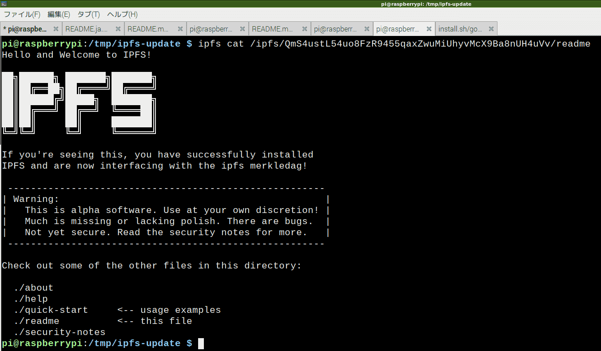

# 環境構築

　

<!-- more -->

# 情報源

* https://docs.ipfs.io/introduction/usage/
	* https://dist.ipfs.io/#go-ipfs

　IPFSはgo言語製。まずはgo言語をインストールする必要がある。

* [golang](https://golang.org/doc/install)

# go言語インストール

　Raspbian busterにパッケージがあるか探してみた。あった。

```sh
apt search golang | grep golang | grep -v github
```
```sh
dh-golang/stable,stable 1.39 all
  debhelper add-on for packaging software written in Go (golang)
dh-make-golang/stable,stable 0.0~git20180827.d94f0cb-1+b9 armhf
golang/stable,stable 2:1.11~1+b6 armhf
golang-1.10/stable,stable 1.10.7-2+rpi1 all
golang-1.10-doc/stable,stable 1.10.7-2+rpi1 all
...
```

　インストールする。

```sh
sudo apt install -y golang
```
```sh
この操作後に追加で 258 MB のディスク容量が消費されます。
```

## ヘルプ表示

```sh
go -h
```
<details><summary>help</summary>
```sh
Go is a tool for managing Go source code.

Usage:

	go <command> [arguments]

The commands are:

	bug         start a bug report
	build       compile packages and dependencies
	clean       remove object files and cached files
	doc         show documentation for package or symbol
	env         print Go environment information
	fix         update packages to use new APIs
	fmt         gofmt (reformat) package sources
	generate    generate Go files by processing source
	get         download and install packages and dependencies
	install     compile and install packages and dependencies
	list        list packages or modules
	mod         module maintenance
	run         compile and run Go program
	test        test packages
	tool        run specified go tool
	version     print Go version
	vet         report likely mistakes in packages

Use "go help <command>" for more information about a command.

Additional help topics:

	buildmode   build modes
	c           calling between Go and C
	cache       build and test caching
	environment environment variables
	filetype    file types
	go.mod      the go.mod file
	gopath      GOPATH environment variable
	gopath-get  legacy GOPATH go get
	goproxy     module proxy protocol
	importpath  import path syntax
	modules     modules, module versions, and more
	module-get  module-aware go get
	packages    package lists and patterns
	testflag    testing flags
	testfunc    testing functions

Use "go help <topic>" for more information about that topic.
```
</details>

## バージョン確認

```sh
$ go version
go version go1.11.6 linux/arm
```

## 環境変数のセット

　go1.8以降はデフォルト値があるらしい。変更したいなら以下のように。今回はいじらずそのまま。確認したら`$HOME/go`なんてなかったんだが？

* https://github.com/golang/go/wiki/SettingGOPATH

~/.bash_profile
```sh
export GOROOT=$HOME/go
export GOPATH=$HOME/go/goroot
export PATH=$PATH:$HOME/go/bin
```

## go言語でハローワールド

　ソースコードを書く。

a.go
```sh
package main
import "fmt"
func main() {
    fmt.Printf("hello, world\n")
}
```

　実行する。

```sh
go run a.go
```

　結果。OK！

```sh
hello, world
```

# IPFSインストール

　やっと本題。

* https://docs.ipfs.io/introduction/usage/
	* https://dist.ipfs.io/#go-ipfs
		* https://dist.ipfs.io/go-ipfs/v0.4.23/go-ipfs_v0.4.23_linux-arm.tar.gz

```sh
wget https://dist.ipfs.io/go-ipfs/v0.4.23/go-ipfs_v0.4.23_linux-arm.tar.gz
tar xvzf go-ipfs_v0.4.23_linux-arm.tar.gz
cd go-ipfs
sudo ./install.sh
```

　なんか出た。`/usr/local/bin`に移動されたんだってよ。

```sh
Moved ./ipfs to /usr/local/bin
```

　インストールされたか確認。

```sh
$ which ipfs
/usr/local/bin/ipfs
```

```sh
$ ipfs version
ipfs version 0.4.23
```

　OK！

<details><summary>失敗</summary>
　じつは最初、間違ってLinux 32bit版を選択してしまい失敗した。以下、そのログ。

* https://dist.ipfs.io/go-ipfs/v0.4.23/go-ipfs_v0.4.23_linux-386.tar.gz

```sh
wget https://dist.ipfs.io/go-ipfs/v0.4.23/go-ipfs_v0.4.23_linux-386.tar.gz
tar xvzf go-ipfs_v0.4.23_linux-386.tar.gz
cd go-ipfs
sudo ./install.sh
```

```sh
Moved ./ipfs to /usr/local/bin
```

　インストールされたか確認。

```sh
$ which ipfs
/usr/local/bin/ipfs
```

　あるぇ？　エラーだよ？

```sh
$ ipfs version
bash: /usr/local/bin/ipfs: バイナリファイルを実行できません: 実行形式エラー
```

　アンインストールできねぇ……。

```sh
$ sudo ./uninstall.sh
sudo: ./uninstall.sh: コマンドが見つかりません
$ ./uninstall.sh
bash: ./uninstall.sh: そのようなファイルやディレクトリはありません
```

　でもこの後`ARM`版をダウンロードしてそのまま`./install.sh`したら成功した。

</details>

# ipfs-update

　IPFS更新ツール。

* https://dist.ipfs.io/#ipfs-update
	* https://dist.ipfs.io/ipfs-update/v1.5.3/ipfs-update_v1.5.3_linux-arm.tar.gz

```sh
wget https://dist.ipfs.io/ipfs-update/v1.5.3/ipfs-update_v1.5.3_linux-arm.tar.gz
tar xvzf ipfs-update_v1.5.3_linux-arm.tar.gz
cd ipfs-update
sudo ./install.sh
```
```sh
installed /usr/local/bin/ipfs-update
```

　インストールされたか確認。

```sh
$ which ipfs-update
/usr/local/bin/ipfs-update
```

```sh
$ ipfs-update version
v0.4.23
```

　OK！

# リポジトリ初期化

　まだあるんかい！

```sh
ipfs init
```
```sh
initializing IPFS node at /home/pi/.ipfs
generating 2048-bit RSA keypair...done
peer identity: QmcdBcqUeW1ESMZrU7pgU6HFwSeqTSMBJ9e7ihZcBYPniH
to get started, enter:

	ipfs cat /ipfs/QmS4ustL54uo8FzR9455qaxZwuMiUhyvMcX9Ba8nUH4uVv/readme

```

　出てきたコマンドをそのまま以下のように叩く。

```sh
ipfs cat /ipfs/QmS4ustL54uo8FzR9455qaxZwuMiUhyvMcX9Ba8nUH4uVv/readme
```



```sh
Hello and Welcome to IPFS!

██╗██████╗ ███████╗███████╗
██║██╔══██╗██╔════╝██╔════╝
██║██████╔╝█████╗  ███████╗
██║██╔═══╝ ██╔══╝  ╚════██║
██║██║     ██║     ███████║
╚═╝╚═╝     ╚═╝     ╚══════╝

If you're seeing this, you have successfully installed
IPFS and are now interfacing with the ipfs merkledag!

 -------------------------------------------------------
| Warning:                                              |
|   This is alpha software. Use at your own discretion! |
|   Much is missing or lacking polish. There are bugs.  |
|   Not yet secure. Read the security notes for more.   |
 -------------------------------------------------------

Check out some of the other files in this directory:

  ./about
  ./help
  ./quick-start     <-- usage examples
  ./readme          <-- this file
  ./security-notes
```

# 公開する

* https://docs.ipfs.io/introduction/usage/

# 参考

* https://medium.com/@yuyasugano/ipfs%E3%82%B2%E3%83%BC%E3%83%88%E3%82%A6%E3%82%A7%E3%82%A4%E6%A7%8B%E7%AF%89%E3%81%A8%E9%81%8B%E7%94%A8-e57b5ad1e830

# 対象環境

* <time datetime="2020-02-04T17:52:50+0900" title="実施日">2020-02-04</time>
* [Raspbierry pi](https://ja.wikipedia.org/wiki/Raspberry_Pi) 4 Model B
* [Raspbian buster](https://ja.wikipedia.org/wiki/Raspbian) 10.0 2019-09-26 [※](http://ytyaru.hatenablog.com/entry/2019/12/25/222222)
* [bash](https://ja.wikipedia.org/wiki/Bash) 5.0.3(1)-release

```sh
$ uname -a
Linux raspberrypi 4.19.75-v7l+ #1270 SMP Tue Sep 24 18:51:41 BST 2019 armv7l GNU/Linux
```
